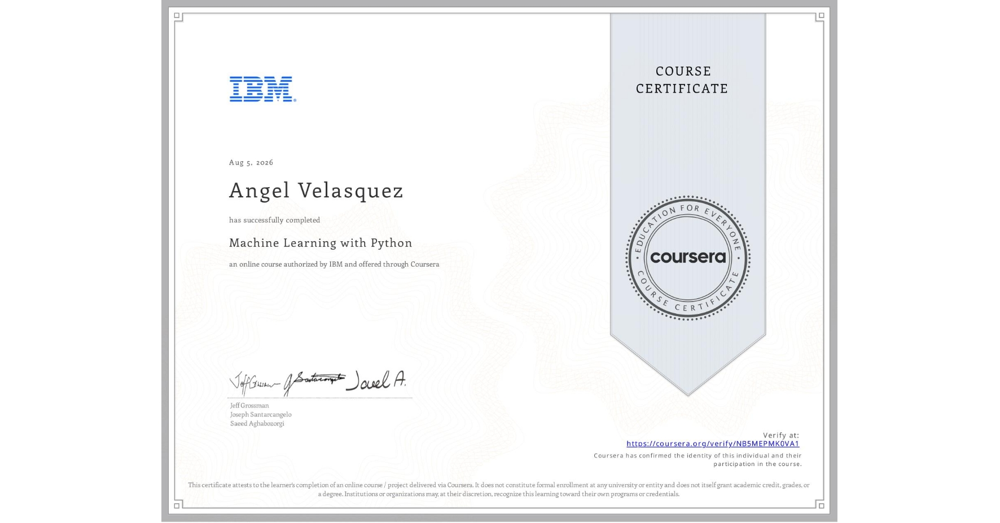

# Course 1: Machine Learning with Python
The folder contains the modules with hands-on labs for the Machine Learning with Python course by IBM.

* ## 📁 [Module 2: Lineaer and Logistic Regression](./module-02-linear-logistic-regression/)
* ## 📁 [Module 3: Building Supervised Learning Models](./module-03-supervised-learning-models/)
* ## 📁 [Module 4: Building Unsupervised Learning Models](./module-04-unsupervised-learning-models/)
* ## 📁 [Module 5: Evaluating and Validating Machine Learning Models](./module-05-evaluate-ml-models/)
* ## 📁 [Module 6: Final Project and Exam](./module-06-final-project-exam/)

