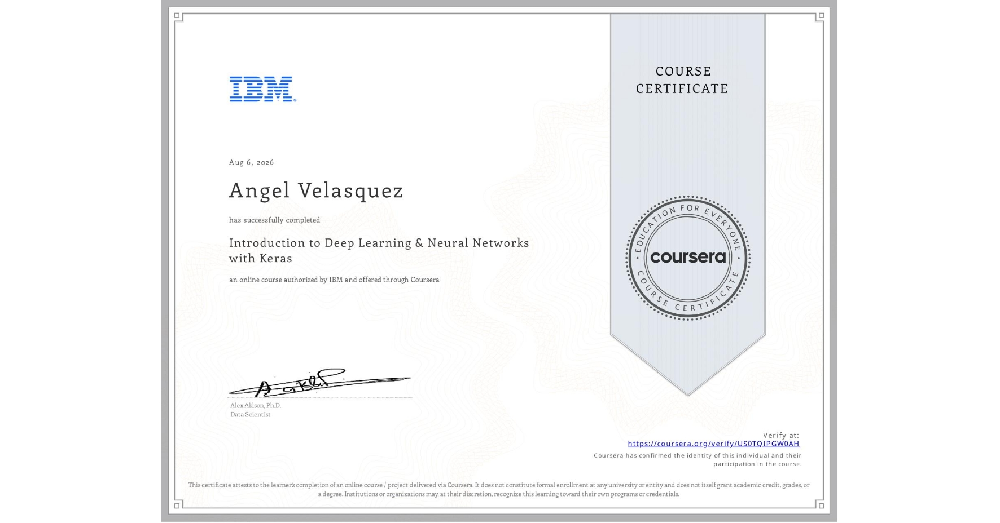

# Course 2: Introduction to Deep Learning & Neural Networks with Keras
The folder contains the modules with hands-on labs for the Introduction to Deep Learning & Neural Networks with Keras course by IBM.

* ## 📁 [Module 1: Introduction to Deep Learning and Neural Networks](./module-01-intro-deep-learning-neural-networks/)
* ## 📁 [Module 2: Basics of Deep Learning](./module-02-basics-deep-learning/)
* ## 📁 [Module 3: Keras and Deep Learning Libraries](./module-03-keras-deep-learning-libraries/)
* ## 📁 [Module 4: Deep Learning Models](./module-04-deep-learning-models/)
* ## 📁 [Module 5: Final Project](./module-05-final-project/)

