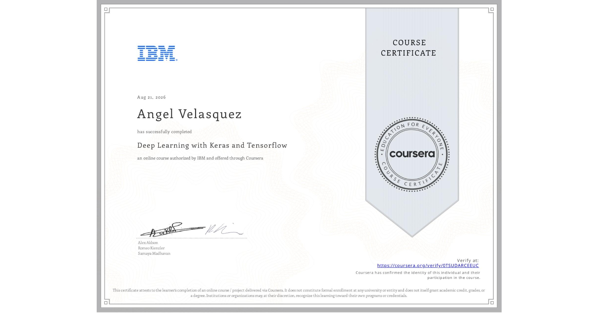

# Course 3: Deep Learning with Keras and Tensorflow
The folder contains the modules with hands-on labs for the Deep Learning with Keras and Tensorflow course by IBM.

* ## 📁 [Module 1: Advanced Keras Functionalities](./module-01-advanced-keras-functionalities/)
* ## 📁 [Module 2: Advanced CNNs with Keras](./module-02-advanced-cnns-keras/)
* ## 📁 [Module 3: Transformers in Keras](./module-03-transformers-keras/)
* ## 📁 [Module 4: Unsupervised Learning and Generative Models in Keras](./module-04-unsupervised-learning-and-generative-models-keras/)
* ## 📁 [Module 5: Advanced Keras Techniques](./module-05-advanced-keras-techniques/)
* ## 📁 [Module 6: Introduction to Reinforcement Learning with Keras](./module-06-introduction-reinforcement-learning-keras/)
* ## 📁 [Module 7: Final Project](./module-07-final-project/)

