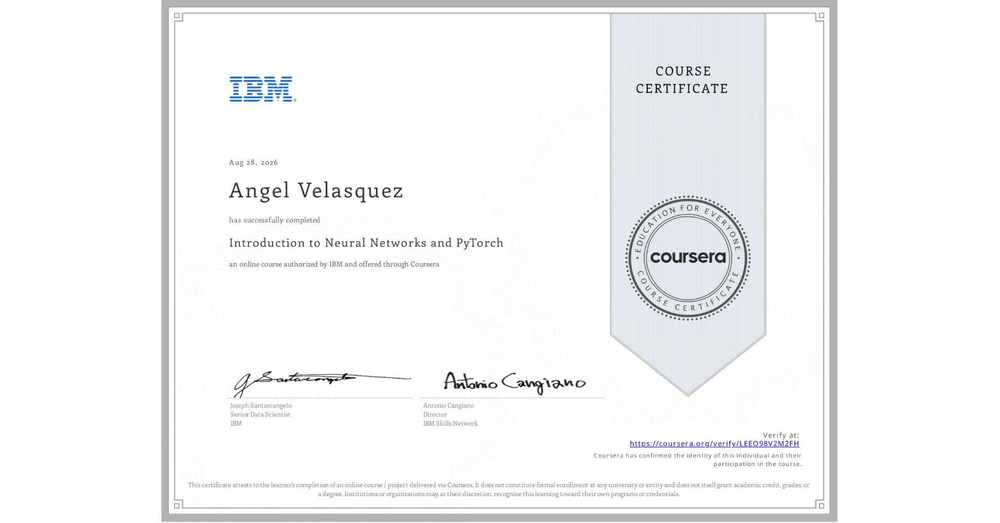

# Course 4: Introduction to Neural Networks and PyTorch
The folder contains the modules with hands-on labs for the Introduction to Neural Networks and PyTorch course by IBM.

* ## 📁 [Module 1: Exploring Tensors](./module-01-exploring-tensors/)
* ## 📁 [Module 2: Building Datasets in PyTorch](./module-02-building-datasets-pytorch/)
* ## 📁 [Module 3: Applying Linear Regression and Gradient Descent](./module-03-applying-linear-regression-gradient-descent/)
* ## 📁 [Module 4: Training Linear Regression Model the PyTorch Way](./module-04-training-linear-regression-models-pytorch-way/)
* ## 📁 [Module 5: Extending Linear Regression to Multiple Inputs and Outputs](./module-05-extending-linear-regression-multiple-inputs-outputs/)
* ## 📁 [Module 6: Applying Logistic Regression for Classification](./module-06-applying-logisitc-regression-classification/)
* ## 📁 [Module 7: Final Project](./module-07-final-project/)

