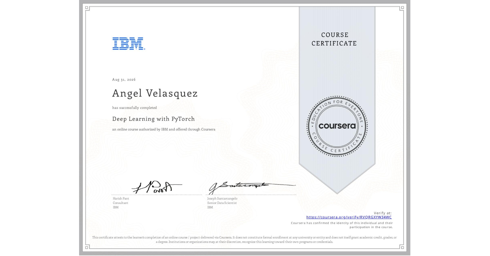

# Course 5: Deep Learning with PyTorch
The folder contains the modules with hands-on labs for the Deep Learning with PyTorch course by IBM.

* ## 📁 [Module 1: Logistic Regression Cross-Entropy Loss](./module-01-logisitc-regression-cross-entropy/)
* ## 📁 [Module 2: Building Softmax Regression Models with Activation Functions](./module-02-building-softmax-regression-models-activation-functions/)
* ## 📁 [Module 3: Developing Shallow Neural Networks](./module-03-developing-shallow-neural-networks/)
* ## 📁 [Module 4: Optimizing Deep Networks](./module-04-optimizing-deep-networks/)
* ## 📁 [Module 5: Building Convolutional Neural Networks](./module-05-building-convolutional-neural-networks/)
* ## 📁 [Module 6: Final Project](./module-06-final-project/)

